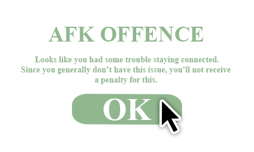

  
  
  
  
  
   
   
  

<h1>Hey!</h1>

**Tired of not being able to leave your computer for a minute? Boss always punish you for AFK, even for a minute?**

**Solution arrived! Meet Anti-AFK!** 🎉️

 
 

<h2>Features</h2>

<h4 style="font-weight: normal">Anti-AFK is a simple application designed to prevent the user from being punished due to inactivity. It achieves this by periodically moving the mouse cursor randomly across the whole screen.</h4>  

<h4>All, what you need:</h4>
<ol>
  <li>Open application;</li>
<li>Set the time interval (5 sec by default); </li>
<li>Click "Start".</li>
</ol>
<h4 style="font-weight: normal">That's all! Now you can leave your computer without any worries!</h4>
<h4 style="font-weight: normal">When you return, just click "Stop" and the application will stop moving the mouse cursor. Simple, isn't it?</h4>

